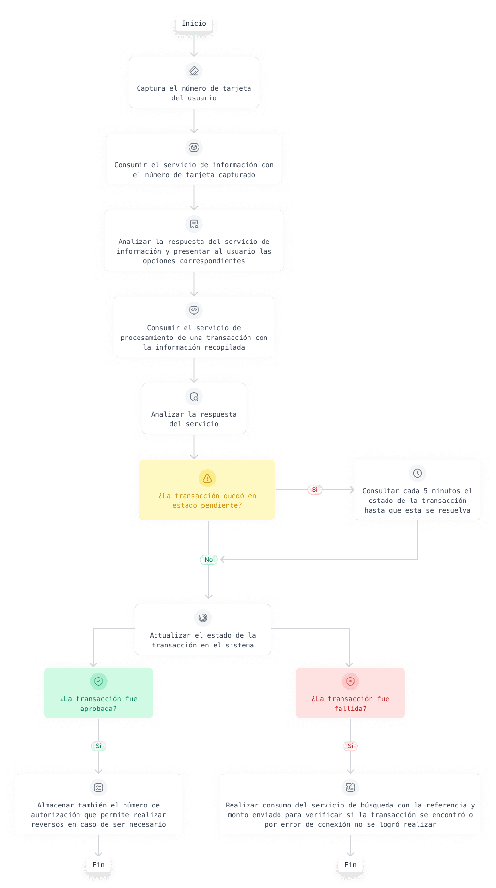

# Integración con Gateway

## ¿Cuándo es mejor usarla?

<!-- theme: info -->
> Este mecanismo sólo debe ser usado por aquellos clientes de la plataforma que requieren capturar la información del tarjetahabiente incluyendo los datos sensibles

La integración se recomienda únicamente en los casos que no sea factible que el usuario realice la transacción ingresando los datos sensibles en PlacetoPay o en donde se requiere un control particular de la operación.

 Algunos ejemplos son:

* Cobros recurrentes desde una base de datos propietaria.
* Integración con un sistema de audiorespuesta.
* Múltiples transacciones a diferentes recaudadores con la misma información del tarjetahabiente.
* Interfaz móvil propietaria, no basada en HTML.
* Integración con sistemas cuya entrada de los datos sensibles no la realice directamente el tarjetahabiente.

## ¿Qué obligaciones tengo cuando uso esta integración?

Tenga en cuenta que al usar este tipo de integración, usted está suministrando todos los datos del comprador incluyendo los datos sensibles de la tarjeta, este solo hecho requiere que la captura de la información sea por un mecanismo seguro que no ponga en peligro los datos del tarjetahabiente.  Si la información la captura por una página Web, el punto donde se capturan estos datos debe estar sobre protocolo seguro HTTPS usando certificados de seguridad expedidos por una entidad certificadora acreditada.

Si la captura la realiza por un Call Center, quien obtiene los datos sensibles debe ser un mecanismo de IVR `Interactive Voice Response` o audiorespuesta; esto implicaría un rompimiento en el proceso entre el proceso que realiza el operador con su CRM y el IVR quien captura los datos sensibles.  Finalmente el CRM consolida los dos conjuntos de datos y los remite a Place to Pay.

Si la captura proviene de una base de datos de tarjetas previamente inscritas, asegúrese que esta información está encriptada por un mecanismo seguro de encriptación como AES o 3DES, desencripte solo en el momento en que construye la trama a ser enviada a Place to Pay. Place to Pay tiene servicios de tokenización que pueden ser usados.

Tenga en cuenta que como regla general usted no debe almacenar el número de tarjeta, fecha de vencimiento y CVV2.  Estos solo pueden tener persistencia durante la solicitud de la autorización, una vez procesada no deben ser almacenados.

Como cualquier proceso de integración, este requerirá una certificación del personal de soporte de Place to Pay para revisar temas de funcionamiento, mejores prácticas y usabilidad.

## Flujo de una transacción

Se trata de un proceso para realizar la transacción que involucra el consumo de los servicios descritos en este documento.

1. Una vez se capture el número de tarjeta del usuario se realiza el consumo al servicio de información `information` enviándolo en la petición
2. Se analiza la respuesta del servicio para disponer las opciones que siguen
    * Si la respuesta trae tipos de crédito `credits` se deben mostrar al usuario para permitirle seleccionar cual desea usar.
    * Si la respuesta trae el parámetro `requirePocket` en true, se debe mostrar los bolsillos `pockets` al usuario para permitirle seleccionar cual desea usar.
    * Si la respuesta trae el parámetro `requireAvs` en true, se debe exigir del usuario el ingreso de código postal y validar la entrada con el formato `zipCodeFormat`.
    * Si la respuesta trae el parámetro `accountVerification` en true, se debe hacer el consumo al servicio de verificación de cuentas y obtener el instrumento cuenta verificado.
    * Si la respuesta tiene el parámetro `displayInterest` en true, se debe, una vez seleccionado un tipo de crédito, consumir el servicio de cálculo de intereses `interests` y mostrar al usuario la respuesta, así cada vez que el usuario cambie de tipo de crédito.
    * Si la respuesta trae el parámetro `requireOtp` en true, se debe hacer el consumo al servicio de generación de OTP (otpGeneration) y obtener del usuario el código que será de 6 dígitos para enviarlo posteriormente en el servicio de validación de OTP `otp/validate` una vez se tenga una respuesta se enviará el resultado signature bajo el campo OTP de la solicitud de procesamiento.
3. Una vez se haya obtenido el tipo de crédito (si lo hay), el código postal, el bolsillo, la cuenta verificada, el OTP (si se requiere) se consume el servicio de procesamiento de transacción `process` y se analiza la respuesta que puede ser final aprobada, declinada o fallida o que puede estar pendiente. En ambos casos se retornará un valor para internalReference que es muy importante almacenar porque le permitirá realizar consultas posteriores con el servicio `query`.
    * Si se aprobó la transacción es importante almacenar también el número de autorización, le permitirá realizar reversos posteriormente si fuese necesario.
    * Generalmente las transacciones son culminadas en un tiempo corto (menos de 3 seg), pero si la transacción queda en estado pendiente es importante tener un cron job o similar que esté consultando cada 5 minutos por las transacciones pendientes hasta que se resuelvan.

4. Generalmente las transacciones son culminadas en un tiempo corto (menos de 3 seg), pero se pueden dar los siguientes escenarios que deben controlarse
    * Si la respuesta es pendiente, se puede tomar la referencia interna y realizar un consumo al servicio de query cada 5m hasta que termine en un estado final (APPROVED, REJECTED o FAILED).
    * Si hubo una falla en la red o en el servicio y no se tiene respuesta del servicio de `process`, es necesario realizar un consumo del servicio de `search` con la referencia y monto enviado hasta que este servicio te confirme o bien que encontró la transacción o que efectivamente por el error de conexión no se logró realizar.

### Diagrama de flujo de una transacción

